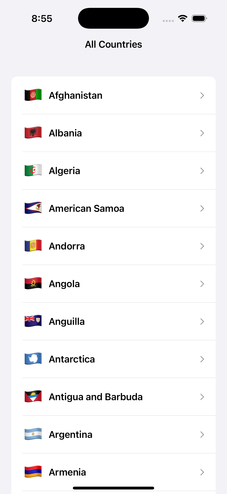
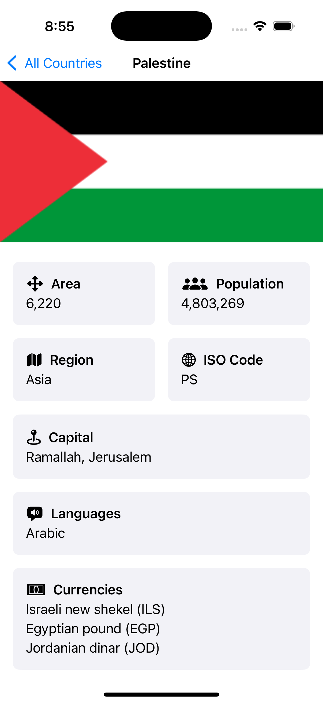

# 🗺️ CountriesApp
An iOS countries info app using **Swift Concurrency** & **SwiftUI**. This project was developed as a hands-on practice to enhance my skills in **Swift 6**, **Unit Testing**, **Clean Architecture**, **MVVM-C Design Pattern**, and **Modularization**.

 

## 🌟 Features
* Fetch & display all countries in a list
* Fetch detailed info for certain country for details screen

 

## 🖼️ Screenshots

| **Listing Screen** | **Details Screen** |
| ------------------ | ------------------ |
| ! | ! |

 

## ☁️ API
This project uses the [REST Countries](https://restcountries.com/) API 3.1.

 

## 🛠️ Tech Stack
* Swift 6
* SwiftUI
* Swift Package Manager (SPM)
* Swift Testing for Unit Tests
* MVVM-C Design Pattern
* Clean Architecture
* Modularization
* Swift Concurrency
* String Catalog for Localization

 

## 🗂️ Modules
* **Network Layer:** A module for handling network request logic. Built using Swift Concurrency and URLSession with Endpoint protocol mechanism.
* **Core Layer:** A module for encapsulating all the shared core files and extension.
* **Countries Module:** A module for countries features listing and details.

 

## ✅ Units Tests
* Network Service in Network Module
* View Models in Countries Module
